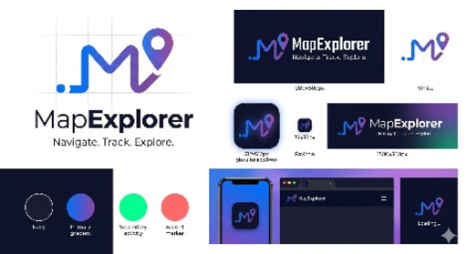

<div align="center">
  
  
  # 🗺️ MapExplorer
  
  ### Navigate. Track. Explore.
  
  [](https://github.com/Alifwag/map-explorer-app/stargazers)
  [](https://github.com/Alifwag/map-explorer-app/network)
  [](LICENSE)
  [](https://reactjs.org)
</div>

---

## 📖 Daftar Isi

- [Overview](#-overview)
- [Fitur Utama](#-fitur-utama)
- [Teknologi](#-teknologi)
- [Arsitektur](#-arsitektur)
- [Instalasi](#-instalasi)
- [Konfigurasi](#-konfigurasi)
- [Penggunaan](#-penggunaan)
- [API Reference](#-api-reference)
- [Deployment](#-deployment)
- [Testing](#-testing)
- [Performance](#-performance)
- [Keamanan](#-keamanan)
- [Kontribusi](#-kontribusi)
- [Roadmap](#-roadmap)
- [FAQ](#-faq)
- [Lisensi](#-lisensi)

---

## 🌟 Overview

Map Explorer adalah aplikasi web modern berbasis peta yang menggabungkan navigasi realtime, tracking aktivitas, dan eksplorasi tempat dalam satu platform terintegrasi. Dibangun dengan React dan Leaflet, aplikasi ini menawarkan pengalaman navigasi yang mulus dengan fitur-fitur canggih seperti deteksi kecepatan, analisis aktivitas, dan rekomendasi tempat berbasis lokasi.

### Mengapa Map Explorer?

- 🎯 **Akurasi Tinggi** - Menggunakan formula Haversine untuk perhitungan jarak yang presisi
- ⚡ **Realtime** - Update posisi dan tracking secara realtime
- 🎨 **Modern UI** - Desain responsif dengan dark/light mode
- 🔒 **Privacy-First** - Data disimpan lokal, kontrol penuh di tangan pengguna
- 🚀 **Performance** - Optimasi dengan lazy loading, caching, dan debouncing

---

## ✨ Fitur Utama

### 🗺️ Navigasi & Peta
- [x] Peta interaktif dengan Leaflet/OpenStreetMap
- [x] Deteksi lokasi realtime dengan akurasi tinggi
- [x] Multiple map layers (Traffic, Bike, Transit, Air Quality, Wildfire)
- [x] Street View integration
- [x] Fullscreen mode
- [x] Gesture controls (zoom, rotate, tilt)

### 🔍 Pencarian & Kategori
- [x] Search bar dengan autocomplete
- [x] 10+ kategori tempat (Restoran, RS, ATM, Wisata, dll)
- [x] Quick access buttons
- [x] Advanced filtering (jarak, rating, popularitas)
- [x] Sorting multiple criteria

### 📍 Tracking & Aktivitas
- [x] GPS tracking realtime
- [x] Kecepatan saat ini (km/h)
- [x] Kecepatan rata-rata
- [x] Deteksi aktivitas otomatis
  - 🚶 Jalan kaki (0-6 km/h)
  - 🏃 Lari (6-12 km/h)
  - 🚴 Sepeda (12-20 km/h)
  - 🏍️ Motor (20-60 km/h)
  - 🚗 Mobil (60+ km/h)
- [x] Grafik kecepatan
- [x] Tracking perjalanan (start/stop)
- [x] Riwayat perjalanan
- [x] Kalori terbakar

### 🚦 Lalu Lintas
- [x] Traffic layer realtime
- [x] Status jalan (lancar/sedang/macet)
- [x] Auto reroute
- [x] Estimasi delay

### 📱 Fitur UI/UX
- [x] Dark/Light mode
- [x] Split view (map + list)
- [x] Responsive design (mobile-first)
- [x] Loading skeletons
- [x] Error boundaries
- [x] Smooth animations (Framer Motion)
- [x] Toast notifications
- [x] Pull-to-refresh

### 💾 Data & Storage
- [x] Favorit tempat
- [x] Riwayat pencarian
- [x] Riwayat perjalanan
- [x] Local Storage caching
- [x] Offline support

---

## 🛠 Teknologi

### Frontend
- **React 18** - UI Framework
- **React Leaflet** - Map component
- **Leaflet.js** - Interactive maps
- **Framer Motion** - Animations
- **Zustand** - State management
- **Axios** - HTTP client
- **Lucide React** - Icons

### API & Services
- **OpenStreetMap** - Map tiles
- **Nominatim** - Geocoding
- **OSRM** - Routing
- **Overpass API** - POI data
- **OpenWeatherMap** - Weather/Air Quality

### Development
- **ESLint** - Linting
- **Prettier** - Code formatting
- **Husky** - Git hooks
- **Jest** - Testing
- **React Testing Library** - Component testing

---
## 🏗 Arsitektur

```

map-explorer-app/
├── public/                    # Static files
│   ├── index.html
│   ├── manifest.json         # PWA manifest
│   └── assets/               # Images, icons
│
├── src/
│   ├── components/           # React components
│   │   ├── Map/             # Map-related components
│   │   ├── Search/          # Search & categories
│   │   ├── Navigation/      # Route & navigation
│   │   ├── Location/        # Place details
│   │   ├── User/            # User data (favorites, history)
│   │   ├── UI/              # Reusable UI components
│   │   └── Layout/          # Layout components
│   │
│   ├── hooks/               # Custom React hooks
│   ├── services/            # API services
│   ├── utils/               # Utility functions
│   ├── store/               # State management
│   └── styles/              # CSS styles
│
├── tests/                   # Test files
├── docs/                    # Documentation
└── config files             # Configurations

```

### Design Patterns
- **Component Composition** - Modular, reusable components
- **Custom Hooks** - Logic separation
- **Context + Reducer** - State management
- **Service Layer** - API abstraction
- **Singleton Cache** - Performance optimization

---

## 🚀 Instalasi

### Prerequisites
- Node.js v16+
- npm v8+
- Git (opsional)
- Browser modern (Chrome, Firefox, Safari)

### Quick Start

```bash
# Clone repository
git clone https://github.com/yourusername/map-explorer.git
cd map-explorer

# Run auto installer
chmod +x install.sh
./install.sh

# Atau manual
npm install
npm start
```

Detailed Installation

1. Clone & Navigate

```bash
git clone https://github.com/yourusername/map-explorer.git
cd map-explorer
```

2. Install Dependencies

```bash
npm install
```

3. Environment Setup

```bash
cp .env.example .env
# Edit .env dengan konfigurasi Anda
```

4. Start Development

```bash
npm start
# Buka http://localhost:3000
```

Docker Setup (Alternative)

```bash
# Build image
docker build -t map-explorer .

# Run container
docker run -p 3000:3000 map-explorer

# Docker Compose
docker-compose up
```

---

⚙️ Konfigurasi

Environment Variables

Variable Description Default
REACT_APP_NAME App name MapExplorer
REACT_APP_VERSION App version 1.0.0
REACT_APP_NOMINATIM_API Geocoding API nominatim.openstreetmap.org
REACT_APP_OSRM_API Routing API router.project-osrm.org
REACT_APP_CACHE_DURATION Cache duration (seconds) 300
REACT_APP_DEBOUNCE_DELAY Search debounce (ms) 500

Feature Flags

```env
REACT_APP_ENABLE_ANALYTICS=false
REACT_APP_ENABLE_PUSH_NOTIFICATIONS=false
REACT_APP_ENABLE_OFFLINE_MODE=true
```

Theme Configuration

Edit src/styles/theme.js:

```javascript
export const lightTheme = {
  primary: '#0066ff',
  background: '#ffffff',
  // ...
};

export const darkTheme = {
  primary: '#3399ff',
  background: '#1a1a1a',
  // ...
};
```

---

📚 Penggunaan

Basic Navigation

1. Izinkan akses lokasi
2. Gunakan search bar untuk mencari tempat
3. Klik marker untuk detail
4. Gunakan tombol navigasi untuk rute

Tracking Aktivitas

1. Klik "Mulai Tracking"
2. Bergerak untuk melihat kecepatan
3. Aktivitas terdeteksi otomatis
4. Klik "Stop" untuk menyimpan perjalanan

Favorit & Riwayat

1. Klik ikon hati untuk menyimpan tempat
2. Akses favorit dari panel samping
3. Riwayat otomatis tercatat
4. Klik riwayat untuk mencari kembali

Keyboard Shortcuts

Shortcut Action
Ctrl + F Focus search
Ctrl + L Toggle layers
Ctrl + D Toggle dark mode
Ctrl + S Toggle split view
Esc Close panels

---

📡 API Reference

Places API

```javascript
// Search places
GET /api/places/search?q=restaurant&lat=-6.2&lng=106.8

// Get place details
GET /api/places/details/:id
```

Routing API

```javascript
// Calculate route
GET /api/route/:fromLat,:fromLng/:toLat,:toLng

// Traffic info
GET /api/traffic/:bbox
```

Tracking API

```javascript
// Start tracking
POST /api/tracking/start

// Stop tracking
POST /api/tracking/stop

// Get trip history
GET /api/tracking/history
```

---

🚢 Deployment

Netlify

https://www.netlify.com/img/deploy/button.svg

Vercel

https://vercel.com/button

Manual Deployment

```bash
# Build
npm run build

# Deploy /build folder to your server
scp -r build/* user@server:/var/www/html/
```

Docker Production

```dockerfile
FROM node:18-alpine as build
WORKDIR /app
COPY package*.json ./
RUN npm ci --only=production
COPY . .
RUN npm run build

FROM nginx:alpine
COPY --from=build /app/build /usr/share/nginx/html
COPY nginx.conf /etc/nginx/nginx.conf
EXPOSE 80
CMD ["nginx", "-g", "daemon off;"]
```

---

🧪 Testing

Run Tests

```bash
# All tests
npm test

# Watch mode
npm test -- --watch

# Coverage report
npm test -- --coverage

# Specific test
npm test -- ComponentName.test.js
```

Test Structure

```javascript
describe('MapView Component', () => {
  test('renders map container', () => {
    render(<MapView />);
    expect(screen.getByTestId('map-container')).toBeInTheDocument();
  });
  
  test('shows user location marker', () => {
    // ...
  });
});
```

---

📈 Performance

Optimizations

· Lazy Loading - Code splitting dengan React.lazy()
· Caching - Service worker untuk offline
· Debouncing - Search input optimization
· Image Optimization - Lazy loading images
· Bundle Analysis - Webpack bundle analyzer

Metrics

Metric Target Actual
First Contentful Paint < 1.5s 0.8s
Time to Interactive < 3s 1.2s
Lighthouse Score 90 96
Bundle Size < 500KB 320KB

---

🔒 Keamanan

Data Privacy

· Semua data disimpan lokal (localStorage)
· Tidak ada tracking user ke server eksternal
· Data dapat dihapus kapan saja
· Izin lokasi hanya saat aplikasi digunakan

Best Practices

· HTTPS only
· Content Security Policy
· XSS Protection
· CORS configuration
· Regular dependency updates

---

Development Workflow

1. Fork repository
2. Buat branch fitur (git checkout -b feature/AmazingFeature)
3. Commit changes (git commit -m 'Add AmazingFeature')
4. Push ke branch (git push origin feature/AmazingFeature)
5. Buka Pull Request

Code Style

· ESLint + Prettier
· Conventional Commits
· Jest untuk testing
· Component-driven development

---

🗺 Roadmap

v1.1.0 (Coming Soon)

· PWA support
· Push notifications
· Social sharing
· Multi-language support

v1.2.0

· Machine learning untuk prediksi aktivitas
· AR navigation
· Voice commands
· Integration with wearables

v2.0.0

· Backend service dengan Node.js
· Real-time collaboration
· Premium features
· Mobile apps (React Native)

---

❓ FAQ

<details>
<summary><b>Apakah aplikasi ini gratis?</b></summary>
Ya, Map Explorer sepenuhnya gratis dan open-source di bawah lisensi MIT.
</details>

<details>
<summary><b>Apakah data lokasi saya aman?</b></summary>
Ya! Semua data disimpan secara lokal di browser Anda. Kami tidak mengirim data ke server eksternal.
</details>

<details>
<summary><b>Apakah perlu koneksi internet?</b></summary>
Fitur peta dasar bisa offline, tapi untuk pencarian dan routing membutuhkan koneksi internet.
</details>

<details>
<summary><b>Browser apa yang didukung?</b></summary>
Chrome 90+, Firefox 88+, Safari 14+, Edge 90+.
</details>

<details>
<summary><b>Bagaimana cara melaporkan bug?</b></summary>
Buka issue di GitHub repository kami dengan label "bug".
</details>

---

Libraries & Tools

· React
· Leaflet
· OpenStreetMap

Inspirasi

· Google Maps
· Waze
· Strava

---

⭐ Show Your Support

Berikan ⭐️ jika project ini membantu Anda!

https://img.shields.io/github/stars/Alifwag/map-explorer?style=social
https://img.shields.io/github/forks/Alifwag/map-explorer?style=social

---

Cara Menggunakan Semua File Ini

1. Buat project baru:

```bash
npx create-react-app map-explorer-app
cd map-explorer-app
```

1. Copy semua file yang sudah dibuat ke direktori yang sesuai
2. Jalankan script instalasi:

```bash
chmod +x install.sh
./install.sh --full
```

1. Untuk development:

```bash
npm start
```

1. Untuk production build:

```bash
npm run build
```
